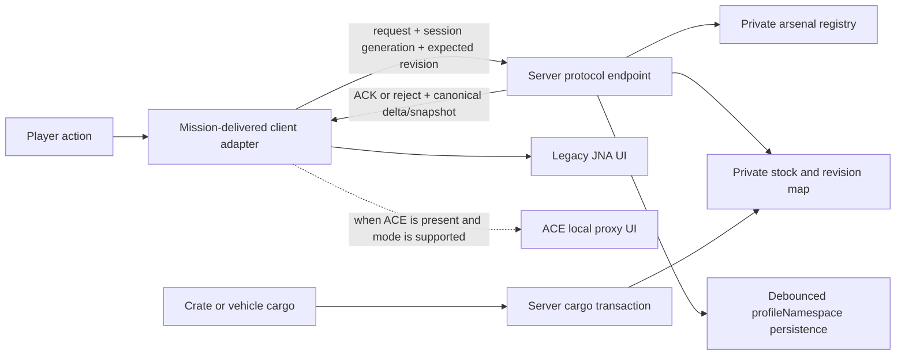

# Mission-only Antistasi Arsenal design

Date: 2026-08-12

Status: approved direction, awaiting written-spec review

Branch: `codex/mission-only-arsenal`

Audience: scenario maintainers, dedicated-server administrators, SQF developers
and multiplayer testers

## 1. Decision

Antistasi Arsenal will be converted from an installed addon into one unpacked
Arma 3 scenario folder. The server administrator deploys that scenario folder;
players do not install `@Antistasi_Arsenal` and do not load an A4A PBO.

The scenario still contains client-side SQF and UI definitions because Arma must
execute interface and inventory operations on the player's machine. Those files
are delivered automatically as mission content. In this design, "server-only"
means one server-deployed scenario artifact and no separately installed A4A
client or server mod.

The resulting product remains a quantitative arsenal. The vehicle Garage is
removed completely. Vehicles are treated only as physical cargo containers, in
the same category as crates, for equipment deposit, withdrawal and transfer.

## 2. Goals

- Deliver one readable, unpacked scenario directory that can be placed directly
  under `MPMissions` and selected by `server.cfg`.
- Require no A4A addon, PBO, key or client-side Workshop subscription.
- Preserve the 27-category quantitative stock model, finite counts, `-1`
  infinite counts, unlock threshold and server-side persistence.
- Preserve the Legacy JNA arsenal as the mandatory no-dependency interface.
- Preserve optional CBA Settings integration when CBA exists.
- Preserve optional ACE Arsenal presentation when ACE exists and the stock mode
  is safe for the current adapter.
- Preserve authorized import/export and per-Arsenal-ID separation.
- Replace the current vehicle cargo UI with a smaller server-authoritative
  container transaction service.
- Keep the mission compatible with hosted MP, dedicated MP, JIP and SP where
  the engine supports the same mission scripts.
- Retain strict `CfgRemoteExec` containment and improve transaction correlation
  instead of carrying the known optimistic-update races into the new layout.

## 3. Explicit non-goals

- No vehicle Garage, vehicle serialization, vehicle UID, vehicle spawning,
  vehicle deletion or vehicle persistence.
- No `CfgPatches`, custom addon class, Eden addon module, `$PBOPREFIX$`, bikey or
  PBO build output in the mission artifact.
- No redistribution of CBA or ACE code inside the scenario.
- No claim that an ACE interface can appear on a client that does not load ACE.
- No reliance on hidden mission files for authorization; clients receive the
  scenario and can inspect it.
- No runtime claim based only on PowerShell checks, config parsing or archive
  inspection.
- No requirement to preserve the old `fn_vehicleArsenal.sqf` UI or Garage data.

## 4. Deployment model

The repository will build the new artifact under one root:

```text
mission/
  A4A_Arsenal_Mission.VR/
    mission.sqm
    description.ext
    Stringtable.xml
    initServer.sqf
    initPlayerLocal.sqf
    README_MISSION_RU.md
    A4A/
      config/
        arsenals.sqf
        settings.sqf
      functions/
        bootstrap/
        server/
        client/
        shared/
        cargo/
        adapters/
          legacy/
          cba/
          ace/
      ui/
      pictures/
```

`A4A_Arsenal_Mission.VR` is the executable reference scenario and integration
fixture. Its contents are also the merge unit for a real scenario on another
terrain. A production copy is renamed to `MissionName.World` and its A4A files
are merged into that scenario root; no second A4A folder is installed elsewhere.

Arma supports a mission directory such as
`MPMissions\MissionName.World\mission.sqm` as a mission-rotation template. PBO
packing remains optional for administrators but is not part of this product or
its verification contract.

## 5. Mission-native configuration

### 5.1 `description.ext`

The addon `config.cpp` is not copied. Supported mission configuration moves to
`description.ext`:

- mission-level `CfgFunctions` with relative `A4A\...` paths;
- mission-level `CfgRemoteExec`;
- required UI resources and dialogs;
- optional mission parameters;
- localization references.

Unsupported addon configuration is removed:

- `CfgPatches`;
- `CfgFactionClasses` used only by addon modules;
- `CfgVehicles` definitions for `A4A_ModuleArsenal` and
  `A4A_ModuleGarage`;
- `Extended_PreInit_EventHandlers`;
- `Garage\Dialogs.hpp`;
- absolute `\A4A_Arsenal\...` resource and function paths.

Mission `CfgFunctions` replaces addon XEH bootstrap. A small `preInit` function
sets constants and dependency-free defaults. Long config enumeration and UI
preload must not run in that unscheduled phase; it is deferred and cached on
machines that need it.

### 5.2 Remote execution policy

The scenario owns the effective policy because mission `description.ext` has
higher precedence than addon configs. It will import existing mod definitions
for compatibility, then set both A4A-relevant modes to whitelist-only:

```cpp
import CfgRemoteExec as CfgRemoteExecMod;

class CfgRemoteExec : CfgRemoteExecMod {
    class Functions {
        mode = 1;
        jip = 0;
        // Audited named endpoints only.
    };
    class Commands {
        mode = 1;
        jip = 0;
    };
};
```

The final list will contain named A4A protocol endpoints and the minimum safe BI
compatibility functions required by the scenario. It will never whitelist
`BIS_fnc_spawn`, `BIS_fnc_call`, `BIS_fnc_execVM`, raw `call`, raw `spawn` or a
debug/arbitrary-code relay.

Every server endpoint additionally verifies execution context,
`remoteExecutedOwner`, human player identity, distance, registered object,
Arsenal ID, session generation, expected revision and payload bounds. The
whitelist is containment, not authorization.

## 6. Scenario registration instead of Eden addon modules

Arsenals are declared in `A4A/config/arsenals.sqf` using mission object variable
names, stable Arsenal IDs and thresholds. Example shape:

```sqf
[
    ["Base", "a4a_arsenal_base", 25]
]
```

At server startup:

1. Resolve each object variable from `missionNamespace`.
2. Reject missing, local-only or duplicate objects and duplicate IDs.
3. Normalize the threshold to a bounded integer.
4. Store `[object, ID, threshold]` only in a private server registry.
5. Load and deeply validate persisted stock.
6. Publish a ready marker only after data and revision are complete.
7. Provide clients only the object reference and presentation metadata required
   to add an action.

Clients may create actions from mission configuration, but a forged action has
no authority: open, cargo and edit requests are accepted only for an object in
the private server registry.

This replaces `A4A_ModuleArsenal`. `A4A_ModuleGarage` has no replacement.

## 7. Runtime ownership model



### 7.1 Server-owned state

The server owns:

- canonical object-to-ID registry;
- ready state;
- 27-bucket stock per Arsenal ID;
- monotonic revision per Arsenal ID;
- session generation and expiry per network owner;
- in-flight reservations and transaction IDs;
- cargo locks;
- editor authorization snapshot;
- persistence scheduling and schema version.

These values live in private server namespaces/maps. Public object variables
may be compatibility mirrors only and are never read back as authority.

### 7.2 Client-owned state

The client owns only:

- the current presentation adapter;
- the snapshot and revision acknowledged by the server;
- temporary loading/display state;
- local inventory mutation requested by an accepted transaction;
- the client-local ACE proxy when ACE mode is active.

Closing or invalidating a session must clear Legacy loading state, Legacy UI,
ACE UI, proxy objects and pending transaction state.

## 8. Quantitative transaction protocol

The existing client-first `UpdateItemAdd/Remove` behavior is not copied as the
new contract. It permits races where physical inventory changes before the
server accepts the stock change and it cannot safely correlate later full
editor saves.

The mission protocol uses correlated requests:

### 8.1 Open

1. Client sends object and a locally generated request nonce.
2. Server resolves the sender and canonical object/ID.
3. Server creates a new opaque session generation bound to owner, UID, object,
   ID, distance, revision and expiry.
4. Response includes object, request nonce, server session generation, stock
   snapshot and revision.
5. Client ignores any response that does not match its latest pending request.

### 8.2 Withdrawal

1. Client requests a bounded item/amount against its acknowledged revision.
2. Server classifies the item, applies reserve rules and atomically reserves or
   rejects stock.
3. Server returns a transaction ID and the accepted amount.
4. Client performs the physical inventory change and reports success/failure.
5. Failure or timeout refunds the reservation; success commits it.
6. Server sends the origin an ACK and sends the canonical revisioned delta to
   every viewer, including the origin.

### 8.3 Return

Return uses a distinct transaction type and never accepts a free-form positive
`UpdateItemAdd` from a client. The client reports the exact local operation and
the server bounds it by the active session and issued transaction. Cargo returns
are stronger: the server observes and clears the global cargo itself before
committing stock.

The protocol does not claim to defeat a fully compromised Arma client. It does
prevent accidental double spend, stale-response corruption, unauthenticated
remote mutation and free-form mint/drain calls through exposed functions.

### 8.4 Editor save

Editor save includes the revision actually applied by that client. The server
does not advance editor-save eligibility merely because the same client sent an
unrelated delta. A full save is rejected and followed by a resync whenever the
expected revision differs from the canonical revision.

## 9. Persistence and data migration

Stock remains server-persisted in `profileNamespace` under stable per-ID keys.
The new mission format adds an explicit schema marker.

On load the server validates:

- exactly 27 buckets;
- every bucket is an array;
- every row is exactly a class/count pair of expected types;
- the class exists in the loaded game/mod config;
- the class maps to the canonical bucket;
- no case-insensitive duplicate exists anywhere in the snapshot;
- amount is `-1` or a finite positive integer within the configured bound;
- total row and serialized-size budgets.

Legacy data is imported only after this validation. Invalid data is quarantined
in memory and logged; it is never partially applied. The old addon profile key
can be read during a one-way migration, but the previous value is retained until
the mission-format save is verified.

Writes remain debounced and generation-aware so a trailing update cannot be
lost. A mission/server stop immediately after a change remains a runtime test
case; static code cannot prove profile flush completion.

## 10. Cargo and vehicles

The Garage tree and its dialog are deleted from the mission product. The old
`fn_vehicleArsenal.sqf` is not ported as-is because it clears physical cargo when
the UI opens and performs fire-and-forget stock deltas.

All physical holders implement one `cargo container` contract. Supported
holders include crates and vehicle objects with inventory capacity. Vehicle
class, fuel, damage, crew, pylons and existence are outside the contract.

Supported operations:

- deposit all supported physical cargo from a crate or vehicle into one
  quantitative Arsenal ID;
- withdraw an acknowledged selection from the arsenal into a crate or vehicle;
- transfer supported physical cargo directly from one crate/vehicle to another;
- inspect a non-destructive summary before confirmation.

Each destructive cargo operation follows this sequence:

1. Resolve sender, source, destination and Arsenal ID from the private session.
2. Validate distance, object existence, allowed holder type and concurrent lock.
3. Snapshot the complete physical cargo, including physical weapon tuples,
   attachments and remaining magazine ammunition.
4. Build and deeply validate the complete post-operation candidate.
5. Check destination capacity or define the exact accepted subset.
6. Apply physical changes on the server with global cargo commands.
7. Commit canonical stock/revision only after physical mutation succeeds.
8. On any failure, restore the snapshot and release every lock in cleanup.
9. Broadcast one revisioned batch result instead of per-item fan-out.

No cargo is cleared before the candidate and rollback snapshot are valid. A
disconnect, timeout or script error must not leave an indefinite busy lock.

## 11. CBA 3.19.0 compatibility contract

Compatibility was checked against the official 3.19.0 release and the locally
installed Workshop PBO `3.19.0.260808` at git `1fb8cbcb`.

CBA remains optional for A4A:

- no `requiredAddons[]` exists in the mission;
- the mission always defines dependency-free defaults;
- settings registration runs on every machine only when
  `CBA_fnc_addSetting` exists;
- registered values are read from their documented resulting global variables
  or `missionNamespace`, not from the nonexistent `CBA_fnc_getSetting`;
- security-sensitive server values are captured from the server's own setting
  state and never refreshed from client-authored network variables;
- event and next-frame helpers are capability-checked, with vanilla fallbacks
  where possible;
- `cba_settings.sqf` is not required. If later added, the mission must set
  `cba_settings_hasSettingsFile = 1` and ship the file in the same scenario
  directory.

CBA 3.19.0 changed the settings UI and added search, but did not remove the
`CBA_fnc_addSetting` signature currently used by A4A. The mission will add a
static contract test for its eight-argument call shape and a runtime test that
the five settings appear and resolve correctly.

## 12. ACE3 3.21.1 compatibility contract

Compatibility was checked against the official 3.21.1 release and the locally
installed `ace_arsenal.pbo` version `3.21.1.112` at git `3c20631a`. The archive
was indexed and all 288 entries were extracted without unsupported entries.

ACE is a client-local optional adapter:

- each client checks `ace_arsenal_fnc_openBox`,
  `ace_arsenal_fnc_addVirtualItems` and required event support locally;
- a client without ACE always uses Legacy JNA without an error;
- the server does not decide ACE availability for all clients;
- A4A never initializes ACE on the persistent arsenal object;
- a temporary `Land_HelipadEmpty_F` is created with `createVehicleLocal`;
- virtual items are applied to that proxy with
  `[_proxy, _items, false] call ace_arsenal_fnc_addVirtualItems`;
- changes use explicit local calls:
  `[_proxy, [_item], false] call ace_arsenal_fnc_addVirtualItems` and
  `[_proxy, [_item], false] call ace_arsenal_fnc_removeVirtualItems`;
- open uses `[_proxy, player, false] call ace_arsenal_fnc_openBox`;
- refresh parameters are explicit;
- cleanup is correlated to the expected `ace_arsenal_currentBox`, deferred one
  frame when needed, and deletes only the A4A-owned local proxy;
- `ace_arsenal_fnc_initBox` is not used, so no persistent ACE interaction or JIP
  entry is installed;
- `ace_arsenal_fnc_removeBox` defaults are never relied upon.

ACE3 3.21.1 includes several Arsenal fixes and improved magazine-class search.
No removal was found for the API calls above. Generated ACE docs and framework
docs disagree on some default-global arguments; the installed SQF confirms
`addVirtualItems` and `removeVirtualItems` default to local while `initBox` and
`removeBox` default to global. The mission therefore always passes the boolean
explicitly.

Current functional containment is preserved: finite V1 quantitative stock uses
Legacy JNA until the ACE adapter participates in the correlated reservation and
ACK protocol. ACE Preview may open only for supported stock mode. This avoids
claiming full finite-stock safety from UI events that occur after ACE has already
mutated a loadout.

ACE3 3.21.1 requires CBA 3.18.5 or newer; CBA 3.19.0 satisfies that requirement.

## 13. Performance design

- Compile mission functions once through `CfgFunctions`; do not repeatedly
  `compile preprocessFileLineNumbers` on hot paths.
- Keep preInit constant-time. Enumerating all weapons, vehicles, glasses and
  magazines is deferred to a scheduled cache build and performed only on
  interface machines that require the UI index.
- Cache item classification and config-name normalization by class name.
- Use per-ID hash maps for server lookup instead of scanning public arrays.
- Send one bounded batch for cargo operations and snapshot replacement.
- Send revisioned deltas for ordinary transactions; send a full snapshot only
  on open, explicit resync or accepted editor save.
- Debounce `saveProfileNamespace` with a trailing-write-safe generation loop.
- Rate-limit editor snapshots and cap both rows and serialized payload size.
- Expire sessions, locks and reservations without per-frame global scans.

Performance numbers remain `NOT_RUN` until measured in a mod-heavy dedicated
session. Static complexity improvements are not benchmark results.

## 14. Error handling and observability

Every network or cargo request returns a structured result containing at least:

- operation name;
- transaction/request ID;
- accepted/rejected status;
- stable reason code;
- Arsenal ID;
- canonical revision;
- optional sanitized delta or replacement snapshot.

The server logs security rejections without echoing unbounded client payloads.
Expected validation failures do not dump entire snapshots. Diagnostic messages
include enough correlation data to match client and server RPT entries.

User-facing failures end loading screens and restore the previous UI/inventory
state. Watchdogs close the exact session generation they opened, never whatever
session happens to be current later.

## 15. Migration sequence

1. Add mission-layout RED tests and a minimal reference scenario skeleton.
2. Move shared constants, classification and array helpers to mission-relative
   `CfgFunctions` paths.
3. Implement mission preInit, server registry, deep persistence validation and
   per-ID readiness.
4. Add request nonce/session generation/revision protocol and make Legacy open
   work without the A4A addon loaded.
5. Move the Legacy quantitative UI and replace absolute resource paths.
6. Implement the generic cargo transaction service, then cover crate-to-crate,
   crate-to-vehicle, vehicle-to-crate and Arsenal deposit/withdrawal.
7. Add optional CBA adapter and replace all `CBA_fnc_getSetting` reads.
8. Add the explicit-local ACE3 3.21.1 proxy adapter and compatibility tests.
9. Remove Garage registration/source from the mission artifact and retire the
   old vehicle UI.
10. Update deployment documentation and run static/config gates.
11. Run SP, hosted and dedicated runtime matrices before declaring parity.

The legacy addon source remains available during migration as a comparison
oracle. It is not deleted until the mission artifact reaches static parity and
the user approves retiring it.

## 16. Test strategy

### 16.1 Automated static/config gates

- PowerShell test parses the mission tree and requires exactly one deployable
  scenario root.
- Mission artifact contains no `CfgPatches`, `$PBOPREFIX$`, addon module,
  `Garage`, PBO output or absolute `\A4A_Arsenal\` path.
- `description.ext` exposes only mission-relative functions.
- `CfgRemoteExec` is mode 1 and contains no arbitrary-code helper.
- Every remote endpoint exists and every remotely callable function has a
  sender/context guard appropriate to its target.
- CBA is optional and `CBA_fnc_getSetting` is absent.
- ACE calls use a client-local proxy and explicit locality booleans.
- Cargo tests require snapshot-before-clear, full candidate validation,
  rollback and lock release.
- Garage class/function/dialog strings are absent from the mission artifact.
- Current addon regression suites remain green while the legacy comparison tree
  exists.
- `CfgConvert -test` or the closest available Arma config parser validates
  `description.ext`.
- UTF-8, delimiter, comment/string and `git diff --check` gates run on changed
  files.

### 16.2 Runtime matrix

| Environment | A4A addon | CBA | ACE | Expected result |
|---|---:|---:|---:|---|
| SP reference mission | no | no | no | Legacy quantitative Arsenal works |
| Hosted MP, two players | no | no | no | revisions, ACKs and viewer deltas converge |
| Dedicated, two players | no | no | no | server authority, persistence and JIP work |
| Dedicated | no | 3.19.0 | no | CBA settings register and Legacy works |
| Dedicated | no | 3.19.0 | 3.21.1 | compatible stock uses ACE proxy; finite stock falls back safely |
| Mixed clients | no | server/client as allowed | mixed ACE | adapter is selected per client; no global assumption |

Required behavior tests include:

- two clients request the last finite item simultaneously;
- delayed response from Arsenal A arrives after Arsenal B was requested;
- same-object duplicate open response arrives after a committed delta;
- editor saves a stale revision;
- client disconnects with a session/reservation/cargo lock;
- JIP after stock mutation;
- server restart restores validated stock;
- corrupted legacy profile data fails closed;
- zero-mass and modded items;
- physical weapon with attachments and loaded magazines in crate/vehicle cargo;
- destination becomes full during transfer;
- ACE display already open, rejected open, normal close and forced invalidation;
- client without CBA/ACE joins a server that uses both for other players.

Live Arma/RPT results are reported as `PASS`, `FAIL`, `BLOCKED` or `NOT_RUN`.
PBO build success is no longer a release gate for the mission product.

## 17. Acceptance criteria

The transition is complete only when all statements below are true:

1. A server can select the unpacked `MissionName.World` folder directly.
2. A clean client with no A4A addon joins and receives all required mission
   files automatically.
3. That client can use the Legacy quantitative Arsenal, including finite stock,
   persistence-safe close and current quantity modifiers.
4. Multiple Arsenal IDs remain isolated and persist across a verified restart.
5. CBA 3.19.0 settings work when present and absence of CBA does not break load.
6. ACE3 3.21.1 uses only an A4A-owned local proxy and falls back safely when
   absent or when finite stock is unsupported.
7. No Garage UI, endpoint, dialog, module or persistence key exists in the
   deployed scenario folder.
8. Vehicles can participate only as cargo holders in tested transfer flows.
9. Concurrent last-item withdrawal produces one accepted physical grant and one
   rejected/resynced client, not two grants.
10. Stale open, close, delta and editor-save messages cannot mutate a newer
    session or revision.
11. Static/config gates pass and required live runtime rows are not `NOT_RUN`.

## 18. Compatibility evidence

Official sources checked on 2026-08-12:

- [CBA_A3 releases](https://github.com/CBATeam/CBA_A3/releases)
- [CBA Settings System](https://github.com/CBATeam/CBA_A3/wiki/CBA-Settings-System)
- [CBA_fnc_addSetting documentation](https://cbateam.github.io/CBA_A3/docs/files/settings/fnc_addSetting-sqf.html)
- [ACE3 releases](https://github.com/acemod/ACE3/releases)
- [ACE Arsenal framework](https://ace3.acemod.org/wiki/framework/arsenal-framework.html)
- [ACE Arsenal function documentation](https://ace3.acemod.org/wiki/functions/arsenal)
- [Bohemia CfgRemoteExec](https://community.bohemia.net/wiki/CfgRemoteExec)
- [Bohemia initialization order](https://community.bohemia.net/wiki/Initialisation_Order)
- [Bohemia server mission rotation](https://community.bohemia.net/wiki/server.cfg)

Local archive evidence checked on 2026-08-12:

- Workshop CBA `mod.cpp`: 3.19.0;
- `cba_settings.pbo`: 127 entries, 127 extracted, 0 skipped, version
  `3.19.0.260808`, git `1fb8cbcb1c81d6af09435f3cfa6d5989d1a2f5ac`;
- Workshop ACE `mod.cpp`: 3.21.1;
- `ace_arsenal.pbo`: 288 entries, 288 extracted, 0 skipped, version
  `3.21.1.112`, git `3c20631a573b6aff8b0e26676c81d8f55384e7b8`.

Archive inspection proves the API source and build version present locally. It
does not prove in-engine behavior; that remains assigned to the runtime matrix.
